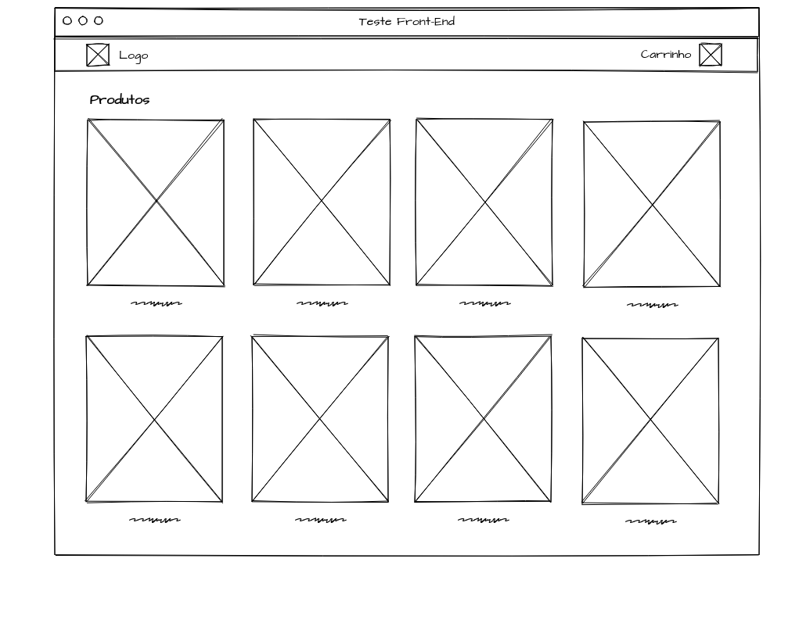
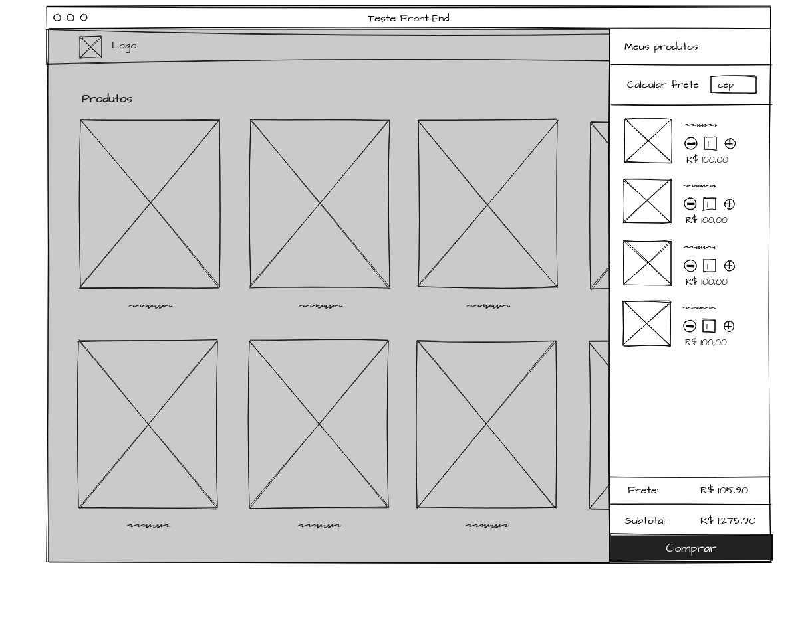

<div align="center">
    <a href="https://www.leroymerlin.com.br" title="Leroy Merlin">
        
    </a>
    <h1 align="center">Teste Frontend - Renato Melo</h1>
</div>

## A Pessoa

**Nome:** `Renato Melo`

**E-mail:** `renatoalves92@gmail.com`

**Usuário:** @renatoam

## O Desafio
O desafio consiste em implementar uma listagem de produtos que permita adicionar produtos no carrinho, ver e manipular a quantidade de items no carrinho.

A página deve conter as seguintes funcionalidades:

- Criar uma lista de produtos, consumindo os dados da [API de produtos](https://zs5utiv3ul.execute-api.us-east-1.amazonaws.com/dev/products);
- Ao clicar no botão "adicionar ao carrinho" localizado no thumbnail do produto a aplicação deve ter os seguintes comportamentos:
  - O valor do número de items contidos no icone de carrinho deve ser atualizado;
  - O produto deve ser adicionado ao Carrinho.

- O carrinho deve listar os produtos adicionados e permitir que:
  - O número de items de cada produto possa ser aumentado ou diminuído;
  - O produto possa ser excluído;
  - Em cada uma dessas interações o valor total do carrinho deve ser atualizado.
  
- Valor do frete é obtido via [API de frete](https://zs5utiv3ul.execute-api.us-east-1.amazonaws.com/dev/freight/<valor-do-cep>)

O layout da página deve estar de acordo com os wireframes e o protótipo feito no Marvel.

## API

[API de frete](https://zs5utiv3ul.execute-api.us-east-1.amazonaws.com/dev/freight/) é um `GET`. É obrigatório passar `CEP` como parametro, ex:

```
https://zs5utiv3ul.execute-api.us-east-1.amazonaws.com/dev/freight/<valor-do-cep>
```
Abaixo é a representação do retorno

```js
{
  freight: '10.00'
}
```


[API de produtos](https://zs5utiv3ul.execute-api.us-east-1.amazonaws.com/dev/products) é um `GET`. Abaixo é a representação de um produto.

```js
{
  id: 89308933,
  name: 'Furadeira de Impacto 1/2\" 1010W Hp2070 220V Makita',
  picture: 'http://url-da-image',
  price: {
    to: {
      integers: 965,
      decimals: 90
    },
    from: null
  },
  unit: 'cada',
  installments: {
    amount: 8,
    price: {
      integers: 120,
      decimals: 74
    }
  },
  tag: {
    label: "Exclusivo on-line"
  },
  offer: {
    label: "Oferta"
    type: "offer"
    value: 11
  },
  url: 'http://link-para-produto'
}
```
---

#### `id` type: Int

Campo `id` não é utilizado na interface.

---

#### `name` type: String

Nome do produto.

---

#### `picture` type: String

Imagem do produto.

---

#### `price` type: Object

Utilizado para mostrar o preço do produto. Ele é um `Object` com os campos:

```js
price: {
  to: {
    integers: 99,
    decimals: 99
  }
}
```

`to` é usado como o preço padrão, ex:


e ele pode conter o `from`.

```js
price: {
  to: {
    integers: 99,
    decimals: 99
  },
  from: {
    integers: 299,
    decimals: 99
  }
}
```
que é utilizado para montar a tag promocional, ex:


---

#### `installments` type: Object

`installments` pode ser `null`. Utilizado na tag de preco, ex:


`installments` retorna um objeto com as props:

- `amount` do tipo `Int`. Representa a quantidade de parcelas;
- `price` do tipo `Object`. Mesma estrutura do `price`.

```js
installments: {
  amount: 8,
  price: {
    integers: 120,
    decimals: 74
  }
}
```

---

#### `unit` type: String

Utilizado na tag de preço. Podendo ser `cada`, `rolo`, `m²`.


---

#### `tag` type: Object

`tag` pode ser `null`. Utilizado como baddge no componente de produto, ex:


`tag` retorna um objeto com a prop:

- `label` do tipo `String`.

```js
tag: {
  label: 'Exclusivo'
}
```

---

#### `offer` type: Object

`offer` pode ser `null`. Utilizado para mostrar o desconto do produto, ex:


`offer` retorna um objeto com as props:
- `label` do tipo `String`;
- `value` do tipo `Int`.

```js
offer: {
  label: "Oferta"
  value: 11
}
```

---

#### `url` type: String

Url do produto.

---

## Spec do layout

A especifição do layout está disponivel no link abaixo:

- [Spec do mobile](https://marvelapp.com/ca4ah6h/screen/60225576)

Abaixo o layout de como devera se parecer quando um usuário acessar por um desktop. Nesta parte você vai ter disponível apenas um wireframe para seguir como base para montar seu layout. Seu teste deve ser responsivo e seguir a identidade visual da spec que foi passada para a parte mobile.




Caso ache interessante, sinta-se a vontade para adicionar ou alterar alguma interação (ex: o feedback de produto adicionado no carrinho).

## Começando

Crie uma nova _branch_ chamada `challenge`.

Na sua máquina, você precisa ter [nodejs](https://nodejs.org/en/) e [yarn](https://yarnpkg.com/pt-BR/docs/install#debian-stable) para conseguir instalar as dependencias do projeto e executar os comandos. Se você já tem eles instalados, comece instalando as dependencias:

```js
yarn install
```

No teste, utilizamos [React](https://reactjs.org/), [Webpack](https://webpack.js.org/) para gerar o bundle (já com uma config basica e com `webpack-dev-server`), [ESLint](https://eslint.org/) (extendendo a config do [standardjs](https://standardjs.com/)), [stylelint](https://stylelint.io/) e [Jest](https://jestjs.io/) (com [react-testing-library](https://github.com/testing-library/react-testing-library)).

Para comecar a desenvolver, basta executar o comando:

```
yarn dev
```

## Testando

Para executar os testes da aplicação, estamos utilizando o `jest`, basta executar o comando:

```js
yarn test
```

e partir daí, é com você :sunglasses:

## O que estamos procurando

Esse desafio visa avaliar sua habilidade de escrever HTML, CSS e JS de forma clara e com código que seja de fácil entendimento para outras pessoas.

Sua tarefa consiste em:

- Escrever código bem estruturado, seguindo boas práticas;
- Escrever testes para cobrir o código criado por você;
- Escrever mensagens de _commit_ baseada no [guideline do angular](https://github.com/angular/angular.js/blob/master/DEVELOPERS.md#-git-commit-guidelines);
- Desenvolver o layout responsivo;

### Bônus

_coisas que seriam legal encontrar_

- Implementar testes e2e (end-to-end)
- Storybook dos componentes

## Entregando o teste

Você deverá abrir um [_Merge Request_](https://docs.gitlab.com/ee/gitlab-basics/add-merge-request.html) (similar ao _Pull Request_ do GitHub) com a sua solução.
Caso você não consiga fazer todos os requisitos que pedimos, não tem problema algum.
Ao entregar, deixe explicado o que você não conseguiu fazer e o que mais achar que faz sentido.

## Dúvidas

O teste foi feito para intencionalmente deixar algumas coisas em aberto.
No entanto, sinta-se livre para tirar dúvidas a qualquer momento.
Para isso, abra _issues_ aqui mesmo no repositório e responderemos assim que possível :nerd_face:

Boa sorte! :four_leaf_clover:
